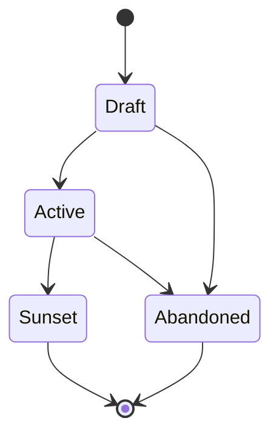
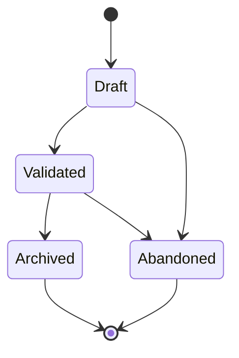
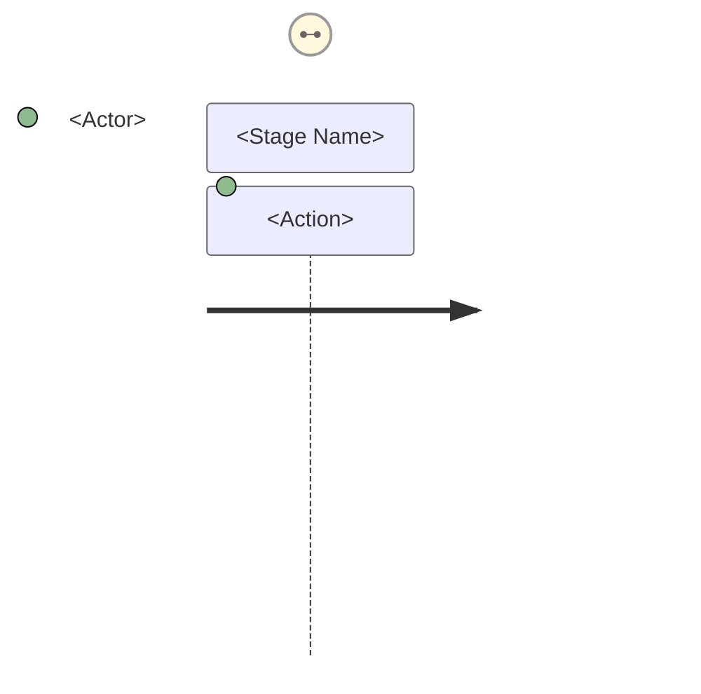
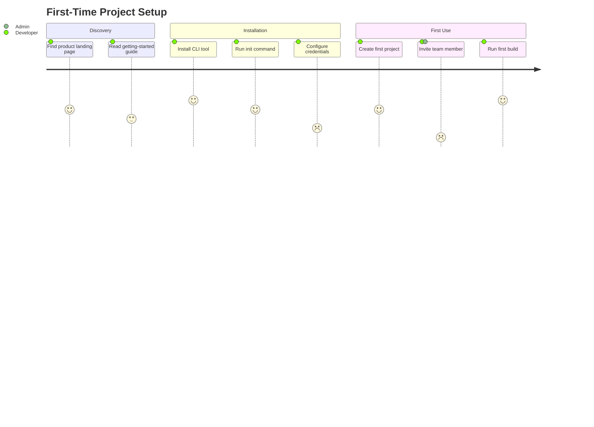
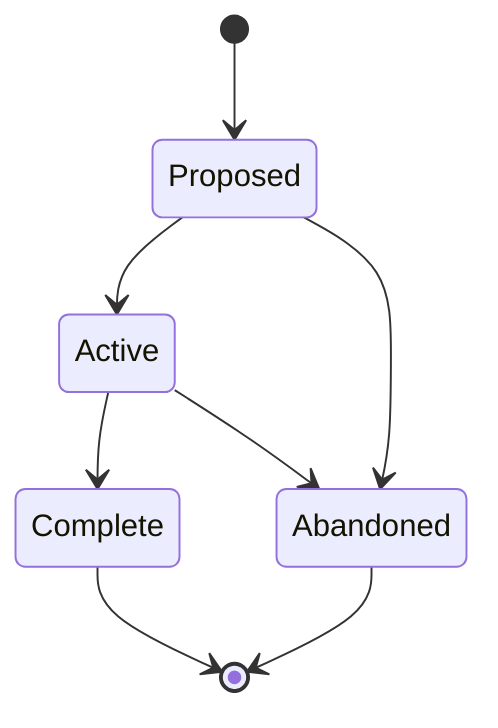
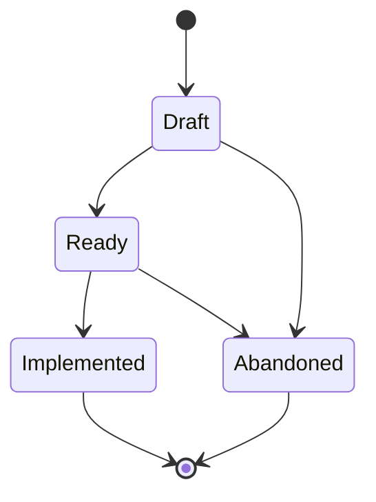
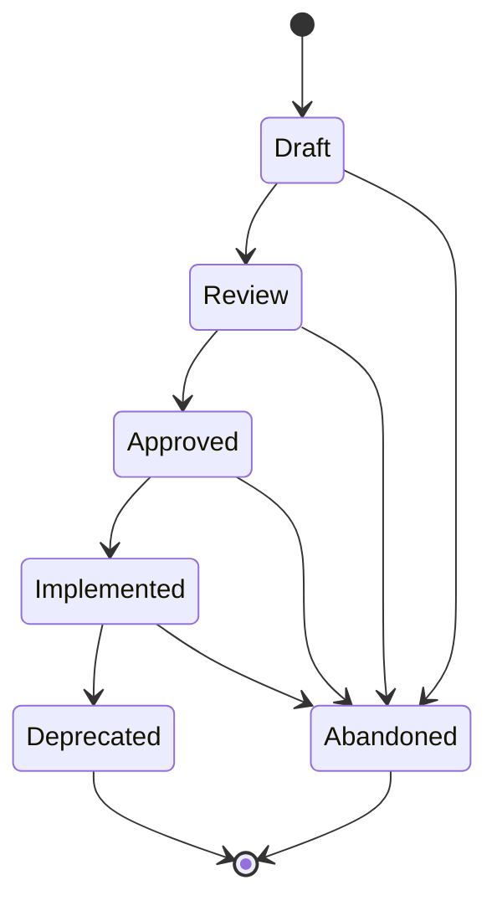
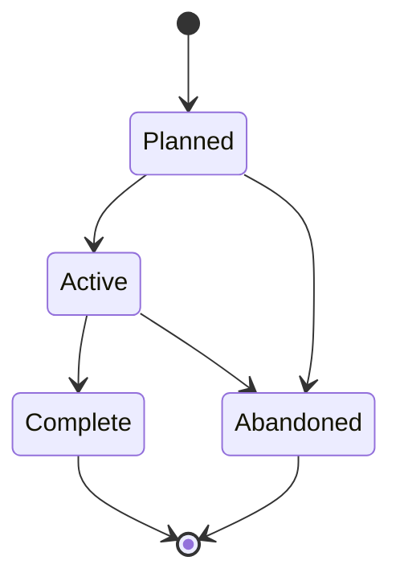
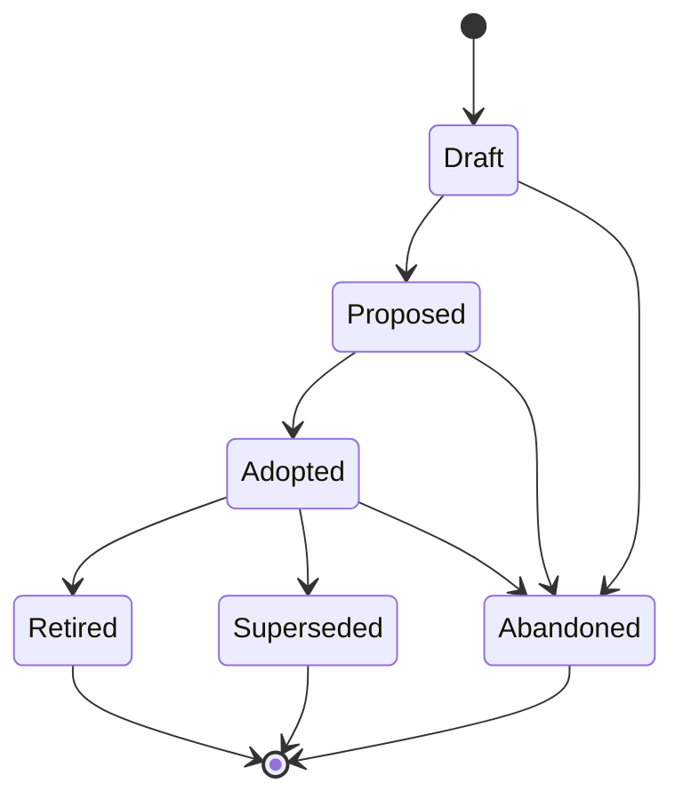

# Spec Management

Create, transition, and validate documentation artifacts defined in AGENTS.md. The authoritative list of artifact types, phases, and hierarchy lives in AGENTS.md — this skill provides the operational procedures.

## Lifecycle table format

Every artifact embeds a lifecycle table tracking phase transitions:

```markdown
### Lifecycle

| Phase | Date | Commit | Notes |
|-------|------|--------|-------|
| Planned | 2026-02-24 | abc1234 | Initial creation |
| Active  | 2026-02-25 | def5678 | Dependency X satisfied |
```

Commit hashes reference the repo state at the time of the transition, not the commit that writes the hash stamp itself. Commit first, then stamp the hash and amend — the pre-amend hash is the correct value.

## Index maintenance

Every doc-type directory keeps a single lifecycle index (`list-<type>.md`). **Refreshing the index is the final step of every artifact operation** — creation, content edits, phase transitions, and abandonment. No artifact change is complete until the index reflects it.

### What "refresh" means

1. Read (or create) `docs/<type>/list-<type>.md`.
2. Ensure one table per active lifecycle phase, plus a table for each end-of-life phase that has entries.
3. For the affected artifact, update its row: title, current phase, last-updated date, and commit hash of the change.
4. If the artifact moved phases, remove it from the old phase table and add it to the new one.
5. Sort rows within each table by artifact number.

### When to refresh

| Operation | Trigger |
|-----------|---------|
| Create artifact | New row in the appropriate phase table |
| Edit artifact content or frontmatter | Update last-updated date and commit hash |
| Transition phase | Move row between phase tables |
| Abandon / end-of-life | Move row to the end-of-life table |

This rule is referenced as the **index refresh step** in the workflows below. Do not skip it.

## Creating artifacts

### Workflow

1. Scan `docs/<type>/` to determine the next available number for the prefix.
2. Create the artifact using the appropriate format (see AGENTS.md artifact types table).
3. Populate frontmatter with the required fields for the type (see the template in `references/<type>.md.j2`).
4. Initialize the lifecycle table with the appropriate phase and current date. This is usually the first phase (Draft, Planned, etc.), but an artifact may be created directly in a later phase if it was fully developed during the conversation (see [Phase skipping](#phase-skipping)).
5. Validate parent references exist (e.g., the Epic referenced by a new Agent Spec must already exist).
6. **Index refresh step** — update `list-<type>.md` (see [Index maintenance](#index-maintenance)).

### Product Vision (VISION-NNN)

**Template:** [references/vision.md.j2](references/vision.md.j2)



The highest-level specification artifact. Follow **Marty Cagan's product vision model** (from *Inspired*): a Vision is a short, aspirational narrative describing the future you want to create for your customers. It communicates *why* the product exists, *who* it serves, and *what better state of the world* it enables — and nothing else.

A Vision is NOT a spec, NOT a feature list, NOT a roadmap, NOT a technical architecture document, and NOT a tracking artifact. If content describes *how* the system is built, *what* technologies it uses, *when* things ship, or *which tasks* remain, it belongs in a child artifact (Epic, Agent Spec, ADR, Spike), not the Vision.

- **Folder structure:** `docs/vision/(VISION-NNN)-<Title>/`
  - Primary file: `(VISION-NNN)-<Title>.md` — the vision document itself.
  - Supporting docs live alongside it in the same folder. These are NOT numbered artifacts — they are informal reference material owned by the Vision.
    - **Expected:** Every Vision SHOULD include an `architecture-overview.md` and a `roadmap.md`. These are the primary supporting docs that give the Vision operational substance.
    - **Optional:** competitive analysis, market research, positioning docs, persona summaries, and other reference material as needed.
- **Architecture overview:** An `architecture-overview.md` in the Vision folder describes *how the system works holistically* — a living description of the system shape. It is descriptive, not decisional. Individual architectural *decisions* ("we chose X over Y because Z") belong in ADRs. When extracting architecture content from a Vision document, split it: the holistic description stays as a Vision supporting doc; discrete decisions with alternatives considered become ADRs.
- **Roadmap:** A `roadmap.md` in the Vision folder organizes child Epics into a sequenced plan. It is prescriptive when initialized — capturing planned Epic order and dependencies — but becomes descriptive as the project progresses: update it to reflect actual Epic phases whenever Epics transition. Include a Mermaid diagram (gantt or graph) for visual sequencing and a status table listing each Epic's current phase, one-line goal, and dependencies on other Epics. The roadmap shows *sequence and dependencies*, not calendar dates or timeline commitments. Detailed task-level tracking belongs in implementation plans (via execution-tracking).
- Should be stable — update infrequently. If a Vision needs frequent revision, it is likely scoped too narrowly (should be an Epic) or too early (needs a Spike first).
- Should fit on roughly one page. If a Vision is growing beyond that, extract detail into supporting docs or child artifacts.
- Vision documents do NOT contain: implementation details, technical analysis, timelines, task breakdowns, tracking tables, dependency graphs, or phase-by-phase rollout plans.

### User Journey (JOURNEY-NNN)

**Template:** [references/journey.md.j2](references/journey.md.j2)



Maps an end-to-end user experience across features and touchpoints. Journeys describe *how a user accomplishes a goal* and surface pain points and opportunities that inform which Epics to create.

- **Folder structure:** `docs/journey/(JOURNEY-NNN)-<Title>/`
  - Primary file: `(JOURNEY-NNN)-<Title>.md` — the journey narrative.
  - Supporting docs: flow charts, interview notes, extended research.
- A Journey is "Validated" when its steps and pain points have been confirmed through user research, stakeholder review, or prototype testing.
- Journeys are *discovery artifacts* — they inform Epic and Agent Spec creation but are not directly implemented. They do NOT contain acceptance criteria or task breakdowns.

#### Mermaid journey diagram

Every journey MUST include a Mermaid `journey` diagram embedded in the primary file. The diagram is a structured visualization of the narrative — it encodes stages, actions, satisfaction levels, and actors in a single view. Place the diagram immediately after the **Steps / Stages** section.

**Syntax:**

~~~markdown

~~~

**Mapping conventions:**

| Journey element | Mermaid element | Rule |
|-----------------|-----------------|------|
| Steps / stages | `section` blocks | One section per stage, in narrative order |
| Actions within a stage | Task lines | Concise verb phrases (3-6 words) |
| Persona | Actor name | Use the persona's archetype label from its PERSONA-NNN, not the artifact ID |
| System / other actors | Additional actors | Add when a handoff or interaction with another party occurs |

**Satisfaction scores** (1–5 scale):

| Score | Sentiment | Signals |
|-------|-----------|---------|
| 5 | Delighted | Moment of delight, exceeds expectations |
| 4 | Satisfied | Works well, minor friction at most |
| 3 | Neutral | Functional but unremarkable |
| 2 | Frustrated | Noticeable friction — flags a **pain point** |
| 1 | Blocked | Severe friction or failure — flags a critical **pain point** |

Every pain point identified in the narrative MUST appear as a score ≤ 2 task in the diagram, and every score ≤ 2 task MUST have a corresponding pain point in the narrative. This keeps the diagram and narrative in sync.

**Example:**

~~~markdown

~~~

In this example, "Configure credentials" (2) and "Invite team member" (1) surface as pain points — the narrative must describe the corresponding friction and opportunities.

**Workflow integration:**

- When creating a journey, draft the narrative first, then build the diagram from it. The diagram is a *derived visualization*, not the source of truth — the narrative is.
- When updating a journey (adding stages, revising pain points), update **both** the narrative and the diagram in the same commit.
- When transitioning a journey to Validated, confirm that satisfaction scores reflect validated research findings, not initial assumptions. Adjust scores as user feedback dictates.

### Epics (EPIC-NNN)

**Template:** [references/epic.md.j2](references/epic.md.j2)



A strategic initiative that decomposes into multiple Agent Specs, Spikes, and ADRs. The **coordination layer** between product vision and feature-level work.

- An Epic is "Complete" when all child Agent Specs reach "Implemented" and success criteria are met.

### User Story (STORY-NNN)

**Template:** [references/story.md.j2](references/story.md.j2)



The atomic unit of user-facing requirements. Follow **Mike Cohn's user story model** (from *User Stories Applied*): a Story captures a single capability from the user's perspective in the "As a / I want / so that" format with clear acceptance criteria. Stories should satisfy the **INVEST** criteria — Independent, Negotiable, Valuable, Estimable, Small, Testable. Decomposes an Epic into verifiable, implementable increments.

- **Format:** Single markdown file at `docs/story/(STORY-NNN)-<Title>.md`.
- Stories should be small enough to implement and verify independently. If a story requires multiple Agent Specs, it is likely scoped too broadly (should be an Epic).
- A Story is "Ready" when acceptance criteria are defined and agreed upon. A Story is "Implemented" when all acceptance criteria pass.

### Agent Specs (SPEC-NNN)

**Template:** [references/spec.md.j2](references/spec.md.j2)



Follow **spec-driven development** principles: an Agent Spec is a behavior contract — precise enough for an agent to create an implementation plan from, but concise enough to scan in a single pass. It defines external behavior (inputs, outputs, preconditions, constraints), not exhaustive requirements. Supplemental detail comes from child Stories and linked research.

- Should be scoped to something a team (or agent) can ship and validate independently.

### Research Spikes (SPIKE-NNN)

**Template:** [references/spike.md.j2](references/spike.md.j2)



A time-boxed investigation to reduce uncertainty before committing to a path. Follow **Kent Beck's spike concept** (from *Extreme Programming Explained*): a Spike is a short, focused experiment that answers a specific technical or design question — it produces *knowledge*, not shippable code.

- Number in intended execution order — sequence communicates priority.
- Gating spikes must define go/no-go criteria with measurable thresholds (not just "investigate X").
- Gating spikes must recommend a specific pivot if the gate fails (not just "reconsider approach").
- Spikes can belong to any artifact type (Vision, Epic, Agent Spec, ADR, Persona). The owning artifact controls all spike tables: questions, risks, gate criteria, dependency graph, execution order, phase mappings, and risk coverage. There is no separate research roadmap document.

### Personas (PERSONA-NNN)

**Template:** [references/persona.md.j2](references/persona.md.j2)


A user archetype that represents a distinct segment of the product's audience. Follow **Alan Cooper's persona model** (from *The Inmates Are Running the Asylum*): a Persona is a concrete, narrative description of a fictional but realistic user — defined by goals, behaviors, and context, not demographics alone. Personas are cross-cutting — they are referenced by Journeys, Stories, Visions, and other artifacts but are not owned by any single one.

- **Folder structure:** `docs/persona/(PERSONA-NNN)-<Title>/`
  - Primary file: `(PERSONA-NNN)-<Title>.md` — the persona definition.
  - Supporting docs: interview notes, survey data, behavioral research, demographic analysis.
- A Persona is "Validated" when its attributes have been confirmed through user research, interviews, or data analysis — not just assumed.
- Personas are *reference artifacts* — they inform Journey, Story, and Agent Spec creation but are not directly implemented. They do NOT contain acceptance criteria, task breakdowns, or feature specifications.

### ADRs (ADR-NNN)

**Template:** [references/adr.md.j2](references/adr.md.j2)



Follow **Michael Nygard's ADR format**: each ADR records a single architectural decision with its context, the decision itself, alternatives considered, and consequences. The format is deliberately lightweight — one decision per document, written in short prose, not a formal specification.

- **Directory structure:** `docs/adr/<Phase>/(ADR-NNN)-<Title>.md` — each ADR is a single Markdown file placed in the subdirectory matching its current lifecycle phase. Phase subdirectories: `Draft/`, `Proposed/`, `Adopted/`, `Retired/`, `Superseded/`.
  - Example: `docs/adr/Adopted/(ADR-001)-Subtree-Split-Distribution-Model.md`
  - When transitioning phases, **move the file** to the new phase directory (e.g., `git mv docs/adr/Draft/(ADR-003)-Foo.md docs/adr/Proposed/(ADR-003)-Foo.md`).
  - **Never** store ADRs flat in `docs/adr/` with phase tracked only in frontmatter — the directory structure must reflect the phase.
- ADRs are cross-cutting: they link to all affected artifacts but are not owned by any single one.
- ADRs are NOT for descriptive or explanatory architecture content. If the content describes "how the system works" without presenting a decision between alternatives, it belongs as an architecture overview supporting doc in the Vision folder — not as an ADR.
- Use the Draft phase while investigation (Spikes) is still in progress. Move to Proposed when the recommendation is formed and ready for review.

## Phase transitions

### Phase skipping

Phases listed in AGENTS.md are available waypoints, not mandatory gates. An artifact may skip intermediate phases and land directly on a later phase in the sequence. This is normal in single-user workflows where drafting and review happen conversationally in the same session.

- The lifecycle table records only the phases the artifact actually occupied — one row per state it landed on, not rows for states it skipped past.
- Skipping is forward-only: an artifact cannot skip backward in its phase sequence.
- **Abandoned** is a universal end-of-life phase available from any state, including Draft. It signals the artifact was intentionally not pursued. Use it instead of deleting artifacts — the record of what was considered and why it was dropped is valuable.
- Other end-of-life transitions (Sunset, Retired, Superseded, Archived, Deprecated) require the artifact to have been in an active state first — you cannot skip directly from Draft to Retired.

### Workflow

1. Validate the target phase is reachable from the current phase (same or later in the sequence; intermediate phases may be skipped).
2. Update the artifact's status field in frontmatter.
3. Commit the change.
4. Append a row to the artifact's lifecycle table with the commit hash from step 3.
5. Amend the commit to include the hash stamp.
6. **Index refresh step** — move the artifact's row to the new phase table (see [Index maintenance](#index-maintenance)).

### Completion rules

- An Epic is "Complete" only when all child Agent Specs are "Implemented" and success criteria are met.
- An Agent Spec is "Implemented" only when its implementation plan is closed (or all tasks are done in fallback mode).
- An ADR is "Superseded" only when the superseding ADR is "Adopted" and links back.

## Implementation plans

Implementation plans are not a doc-type artifact. They bridge declarative specs (`docs/`) and execution tracking. All concrete CLI operations are handled by the **execution-tracking** skill — this skill describes *what* to do, not *how*.

### Prerequisites

Before creating or modifying implementation plans, invoke the **execution-tracking** skill to bootstrap the task backend (availability check, installation if missing, initialization). That skill owns the install, recovery, and CLI command layer.

### Seeding a plan from a spec

1. An Agent Spec (or Epic) may include an "Implementation Approach" section sketching the high-level plan. This seeds the implementation plan but is not the plan of record.
2. When work begins, create an **implementation plan** for the spec artifact, linked via an **origin ref** (e.g., `SPEC-003`).
3. Create **tasks** under the implementation plan with dependencies between them. Tag each task with a **spec tag** for the originating spec.

### Lineage and cross-spec impact

- Every implementation plan has an **origin ref** — an immutable link to the spec that seeded it.
- Every task carries one or more **spec tags** — mutable labels recording which specs it currently affects.
- When a task impacts additional specs, add spec tags for the new specs and create **dependencies** linking related tasks across plans.
- Track provenance when tasks spawn from existing ones.

### Parallel coordination

- Use the execution-tracking skill's parallel coordination features (swarms, formulas) when multiple agents need to pick up **ready work** from the same implementation plan.

### Closing the loop

- Progress is tracked in the execution backend, not in the spec doc. The Agent Spec's lifecycle table records the transition to "Implemented" once the implementation plan completes.
- Cross-spec tasks should be noted in each affected artifact's lifecycle table entry (e.g., "Implemented — shared serializer also covers SPEC-007").

### Fallback

If the **execution-tracking** skill is not available in the current agent environment, fall back to the agent's built-in todo system with canonical states (`todo`, `in_progress`, `blocked`, `done`). The plan structure (ordered steps, dependencies, completion tracking) remains the same — only the backend changes. Lineage is maintained by including artifact IDs in task titles or notes (e.g., `[SPEC-003] Add export endpoint`).
