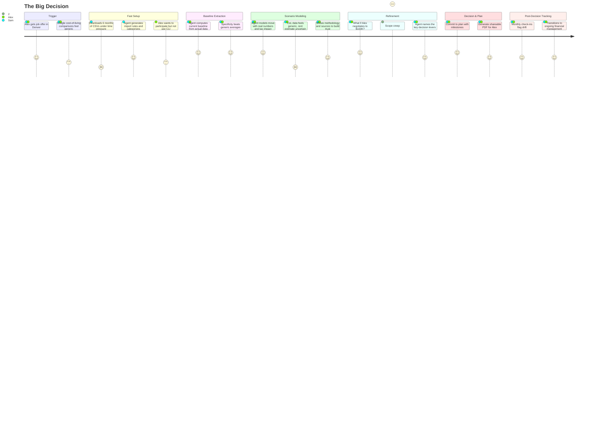

## Lifecycle

| Phase | Date | Commit | Notes |
|-------|------|--------|-------|
| Draft | 2026-02-26 | 19ac5c0 | Initial creation |

---

# JOURNEY-002: The Big Decision

## Persona

**Sam, 34, engineer, married to Alex (32, marketing manager).** Combined income $154K. Rent $2,100 in Austin. Have some savings, no major debt. Financially stable but have never done deep financial modeling. They use a shared checking account and individual credit cards.

Sam is a developer (comfortable with CLI tools). Alex is not — she wants to see results, not run commands.

## Goal

Make a confident, data-grounded decision about a major life event — in this case, Alex's job offer in Denver ($95K vs. current $82K). But the journey applies to any big decision: buying a house, having a kid, one partner going back to school, early retirement.

## Stages

### 1. Trigger

**The event:** Alex gets a job offer in Denver. They have two weeks to decide. The salary is higher, but Denver is more expensive. They've been casually talking about buying a house. Moving changes everything.

**Emotional state:** Excited but anxious. The decision has financial, career, and lifestyle dimensions. They want to make a smart choice, not just go with gut feeling.

**What they do first:** Sam googles "cost of living Austin vs Denver" and gets generic numbers. Alex asks coworkers. Neither feels confident. Sam remembers reading about LLM Finance Wizard.

### 2. Fast Setup (or Existing User)

**Variant A — New user:** Sam downloads 6 months of bank/credit card CSVs and sets up the system. The agent generates import rules and categorizes transactions. This takes 30-60 minutes, not days — urgency compresses the onboarding.

**Variant B — Existing user:** Sam has been using the system for months. Data is current. Skip to Stage 3.

**Pain points:**
- Time pressure — they can't spend a week getting the tool set up
- Shared finances: the agent needs to see both their accounts to model accurately
- Alex wants to participate but doesn't want to use CLI tools

**Opportunities:**
- Fast setup path: "I need to model a decision in the next few days" should be a recognized pattern
- Multi-format output means Sam runs the analysis, Alex reads the dashboard or PDF

### 3. Baseline Extraction

**What the agent does:** Before modeling the move, it establishes where they stand now.

```
Sam:    "We're considering a move from Austin to Denver. Alex got
         an offer for $95K, up from $82K. Can you model this?"

Agent:  Let me start with your current baseline.
        [queries 6-12 months of spending data]
        [executes baseline analysis: income, spending by category,
         savings rate, recurring obligations]

        CURRENT BASELINE (Austin, trailing 6 months)
        Combined gross income:  $154,000/yr ($12,833/mo)
        After-tax income:       $10,450/mo
        Total spending:          $9,240/mo
        Savings rate:            $1,210/mo (11.6%)

        Top categories:
        Rent:           $2,100
        Food:           $1,080  (groceries $620 + dining $460)
        Transport:        $680  (two cars)
        Utilities:        $340
        ...
```

**Why this matters:** Generic cost-of-living calculators use averages. This uses *their actual spending*. The difference is specificity — "your groceries are $620" not "the average household spends $500."

### 4. Scenario Modeling

The core of this journey. The agent models the move with their real numbers, not generic estimates.

```
Agent:  DENVER SCENARIO
        [executes: CoL adjustment per category, tax modeling (TX→CO),
         salary change, rent estimation for comparable area]

        ┌────────────────────────┬──────────┬──────────┬──────────┐
        │ Category               │ Austin   │ Denver   │ Delta    │
        ├────────────────────────┼──────────┼──────────┼──────────┤
        │ Gross income (combined)│ $12,833  │ $13,917  │ +$1,084  │
        │ After-tax income*      │ $10,450  │ $11,180  │  +$730   │
        │ Rent (comparable area) │  $2,100  │  $2,550  │  +$450   │
        │ Groceries (CoL adj)    │    $620  │    $660  │   +$40   │
        │ Utilities              │    $340  │    $370  │   +$30   │
        │ Auto insurance         │    $355  │    $310  │   -$45   │
        │ Other (unchanged)      │  $5,825  │  $5,825  │    $0    │
        ├────────────────────────┼──────────┼──────────┼──────────┤
        │ Net monthly savings    │  $1,210  │  $1,465  │  +$255   │
        └────────────────────────┴──────────┴──────────┴──────────┘
        * Colorado has 4.4% flat state income tax vs. Texas 0%

        One-time relocation costs: ~$11,100
        Break-even on relocation costs: 3.6 years at +$255/month

        The move is modestly positive financially — but the real
        story depends on what Alex negotiates.
```

**Pain points:**
- CoL data needs to be credible — if the rent estimate feels off, trust collapses
- Tax modeling across states is genuinely complex (state income tax, property tax differences, etc.)
- The agent needs to be transparent about what's estimated vs. what's computed from their data

**Opportunities:**
- Show the work: "rent estimate based on Zillow median for 2BR in comparable Denver neighborhoods" builds trust
- Identify what the user *can* control (salary negotiation) vs. what's fixed (state tax rate)

### 5. Interactive Refinement

This is where the decision takes shape.

```
Sam:    "What if Alex negotiates to $100K?"

Agent:  [re-models]
        At $100K: monthly improvement becomes +$570.
        Break-even drops to 1.6 years.
        Annual additional savings: $6,840.
        Invested at 7% over 5 years: ~$39,500.

        The $5K negotiation is worth ~$39K over 5 years.

Alex:   "What about buying a house there instead of renting?"

Agent:  [models rent-vs-buy in Denver at current savings + projected savings]
        At $2,550/month rent, you could afford a ~$380K home with 10% down.
        But your current savings ($18,000) would be nearly depleted by the
        down payment + closing costs + moving costs.

        Recommendation: rent for 12-18 months while saving aggressively
        in Denver. At the $100K salary, you'd have $38K saved in 18 months —
        enough for 10% down on a $380K home with reserves.

Sam:    "Model both: rent 18 months then buy, vs. buy immediately with
         lower down payment."

Agent:  [models two scenarios with PMI, appreciation, opportunity cost]
        ...
```

**Emotional state:** The conversation shifts from anxiety to agency. They're not guessing — they're comparing computed outcomes. Each refinement narrows the decision space.

**Pain points:**
- Scope creep: the decision expands from "move or not" to "move + buy + negotiate + timing." Agent needs to help manage scope without shutting down exploration
- Two users, one agent: Sam is driving but Alex needs to follow and participate

**Opportunities:**
- Generate a shareable summary (PDF or slide deck) that Alex can review without running commands
- The agent should name the key decision levers explicitly: "The three things that matter most here are: (1) Alex's negotiated salary, (2) rent vs. buy timing, (3) whether you sell your car"

### 6. Decision & Plan

```
Sam:    "OK. We're going to accept at $100K (Alex is negotiating),
         rent for a year, then reassess buying."

Agent:  Here's your Denver transition plan:

        Months 1-2: Relocate. Budget $11,100 for moving costs.
        Months 1-12: Rent at ~$2,550. Save aggressively.
        Month 6: Check-in — are you on track for a down payment?
        Month 12: Model buy vs. continue renting with actual Denver data.

        Projected financial state at month 12:
        Savings: ~$25,000 (current $18K - $11K move + $18K saved)
        Monthly savings rate: $1,780/mo (up from $1,210 in Austin)

        Want me to track this plan?
```

**Emotional state:** Confident. The decision is made with data, not vibes. They can articulate *why* they chose this path — to each other, to family, to anyone who asks.

### 7. Post-Decision Tracking

The agent monitors reality against the plan. Monthly check-ins flag drift:

- "Your Denver groceries are running $720 vs. estimated $660 — not a problem yet but worth noting."
- "Month 4: savings rate is $1,650/mo, slightly below the $1,780 target. Dining in Denver is higher than Austin — want to look at that?"
- "Month 6: you're at $22,800 saved. On track for the month-12 reassessment."

The big decision journey transitions into the ongoing financial clarity journey (JOURNEY-001's monthly habit stage).

---

## Journey Diagram



---

## Pain Points Summary

| Stage | Key Pain Point | Mitigation |
|-------|---------------|------------|
| Trigger | Time pressure, anxiety | Fast setup path; immediate value |
| Setup | Shared finances, non-technical partner | Multi-account import; shareable output formats |
| Baseline | "Are these numbers right?" | Ground in actual data; show methodology |
| Modeling | CoL estimates feel generic | Cite sources; distinguish estimated vs. actual |
| Refinement | Scope creep | Agent names the key decision levers |
| Decision | Committing is hard | Clear plan with milestones, not just a number |
| Tracking | Plan drift | Specific, non-judgmental monthly flags |

## Opportunities Summary

| Stage | Key Opportunity |
|-------|----------------|
| Trigger | "I need to model a decision fast" as a recognized entry point |
| Baseline | Specificity: *your* spending, not averages |
| Modeling | Transparent methodology builds trust |
| Refinement | Multi-format output lets non-technical partner participate |
| Decision | Quantify the value of negotiation (the $5K → $39K insight) |
| Tracking | Big decision naturally flows into ongoing financial management |
