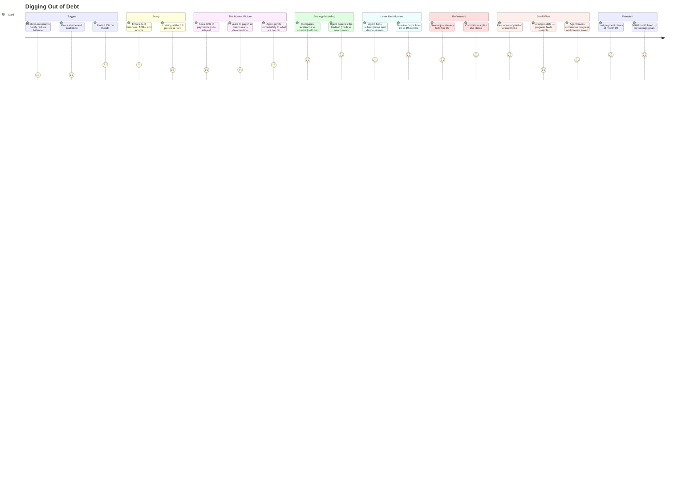

## Lifecycle

| Phase | Date | Commit | Notes |
|-------|------|--------|-------|
| Draft | 2026-02-26 | 19ac5c0 | Initial creation |

---

# JOURNEY-003: Digging Out of Debt

## Persona

**Dani, 28, teacher.** Income $52K. Has $14,200 in debt across four accounts: a $6,800 credit card (22.9% APR), a $3,200 store card (26.9%), a $2,800 personal loan (11.5%), and $1,400 on a second credit card (18.9%). Minimum payments total $485/month. After rent and essentials, she has about $180/month of breathing room beyond minimums.

Dani isn't financially illiterate — she knows the debt is a problem. She's tried the "just pay more" approach but never has a clear strategy. She's heard of avalanche and snowball methods but doesn't know which is better *for her specific debts*.

Dani is not a developer. She uses her phone for banking and a laptop for everything else. She found LFW through a Reddit thread about getting out of debt.

## Goal

Go from overwhelmed by debt to having a concrete, achievable payoff plan — and actually following through.

## Stages

### 1. Trigger

**The moment:** Dani checks her credit card statement and realizes she's been paying minimums for eight months and the balance has barely moved. The minimum payment is $195/month on a $6,800 balance, and $148 of that is interest. She's paying $195 to reduce the balance by $47.

**Emotional state:** Frustrated, slightly ashamed. She's doing "the right thing" (paying on time) but it feels futile.

**What she does:** Searches Reddit for "best way to pay off credit card debt." Finds a post about LFW modeling different payoff strategies with your actual balances and rates. Downloads it.

### 2. Setup & Ingestion

Dani's setup is simpler than Maya's (JOURNEY-001) — she doesn't have years of history to import. She needs:

- Current balances, APRs, and minimum payments for all four debt accounts
- Monthly income and essential expenses (rent, utilities, groceries, transport)
- Whatever spending history she can export (even a month or two helps)

**What the agent does:**
- Imports available CSV data to establish spending patterns
- Asks Dani to confirm the debt details: "I see a $195 payment to Chase each month. What's the current balance and APR?"
- Builds a financial snapshot without needing a complete history — the debt picture is the priority

**Pain points:**
- Dani may not know her APRs offhand — agent should suggest where to find them
- Looking at the full debt picture is emotionally difficult
- Setup can't feel like homework

**Opportunities:**
- Minimal viable setup: the agent can be useful with just debt balances, rates, and monthly income — full spending history improves recommendations but isn't required to start
- The agent should acknowledge the emotional weight: "Let's get the full picture so we can make a plan. This is the hardest part — seeing it all in one place."

### 3. The Honest Picture

```
Dani:   "How bad is it?"

Agent:  [compiles debt landscape]

        YOUR DEBT PICTURE
        ┌────────────────────┬─────────┬────────┬─────────┬───────────┐
        │ Account            │ Balance │ APR    │ Minimum │ Interest  │
        │                    │         │        │         │ /month    │
        ├────────────────────┼─────────┼────────┼─────────┼───────────┤
        │ Store card         │  $3,200 │ 26.9%  │   $85   │   $72     │
        │ Chase Visa         │  $6,800 │ 22.9%  │  $195   │  $130     │
        │ Capital One        │  $1,400 │ 18.9%  │   $35   │   $22     │
        │ Personal loan      │  $2,800 │ 11.5%  │  $170   │   $27     │
        ├────────────────────┼─────────┼────────┼─────────┼───────────┤
        │ Total              │ $14,200 │        │  $485   │  $251     │
        └────────────────────┴─────────┴────────┴─────────┴───────────┘

        You're paying $485/month. $251 of that (52%) goes to interest.
        Only $234 actually reduces your balances.

        At minimums only, you'll be debt-free in 4 years and 3 months,
        and you'll pay $6,940 in total interest — nearly half your
        current balance again.

        But you said you have ~$180/month beyond minimums. That changes
        the picture significantly. Let me model some strategies.
```

**Emotional state:** The interest number ($251/month, $6,940 total) is a gut punch — but it's also clarifying. Dani can see *why* minimums feel futile.

**Opportunities:**
- This is a coaching moment: explain *why* high-APR debt is so destructive, using Dani's own numbers
- "52% goes to interest" is more powerful than any generic advice about debt

### 4. Strategy Modeling

The agent models avalanche vs. snowball with Dani's actual debts — not textbook examples.

```
Agent:  With your $180/month extra, here are two strategies:

        AVALANCHE (highest rate first: store card → Chase → Cap One → loan)
        ┌──────────┬────────────────────────────────────┬──────────────┐
        │ Month    │ Milestone                          │ Total paid   │
        ├──────────┼────────────────────────────────────┼──────────────┤
        │  Month 7 │ Store card ($3,200) paid off       │   $4,655     │
        │ Month 18 │ Chase Visa ($6,800) paid off       │  $11,970     │
        │ Month 21 │ Capital One ($1,400) paid off      │  $13,965     │
        │ Month 25 │ Personal loan ($2,800) paid off    │  $16,560     │
        └──────────┴────────────────────────────────────┴──────────────┘
        Total interest paid: $2,360
        Debt-free: month 25 (just over 2 years)

        SNOWBALL (smallest balance first: Cap One → loan → store → Chase)
        ┌──────────┬────────────────────────────────────┬──────────────┐
        │ Month    │ Milestone                          │ Total paid   │
        ├──────────┼────────────────────────────────────┼──────────────┤
        │  Month 4 │ Capital One ($1,400) paid off      │   $2,660     │
        │ Month 11 │ Personal loan ($2,800) paid off    │   $7,315     │
        │ Month 19 │ Store card ($3,200) paid off       │  $12,645     │
        │ Month 27 │ Chase Visa ($6,800) paid off       │  $17,690     │
        └──────────┴────────────────────────────────────┴──────────────┘
        Total interest paid: $3,490
        Debt-free: month 27

        COMPARISON
        Avalanche saves you $1,130 in interest and finishes 2 months sooner.

        But snowball gives you a win in month 4 (Cap One gone) and frees
        up $35/month of cash flow. With avalanche, your first payoff
        isn't until month 7, and cash flow doesn't improve until then.

        Your emergency buffer is thin ($180/month). The early cash flow
        from snowball could matter if something unexpected hits in
        months 1-6.
```

**What makes this different from a generic calculator:** The agent doesn't just compute — it *coaches*. It identifies the tradeoff (interest savings vs. early cash flow) and connects it to Dani's actual situation (thin buffer).

**Pain points:**
- Both timelines feel long (25-27 months). Dani needs to believe it's achievable.
- The "right" strategy depends on Dani's psychology, not just math — the agent should respect that

**Opportunities:**
- Lever identification can accelerate the timeline — find money Dani didn't know she could redirect
- The agent should present a hybrid option if the numbers support it

### 5. Lever Identification (Accelerating the Timeline)

```
Dani:   "Is there any way to speed this up?"

Agent:  [scans spending for levers]

        I found three potential levers:

        1. Subscriptions: You have 5 totaling $68/month. Two show
           no recent usage (streaming service $15, fitness app $10).
           Canceling saves $25/month.

        2. Dining out: $220/month average. Reducing to $150 saves
           $70/month. That's roughly one fewer restaurant meal per week.

        3. Balance transfer: Your Chase card (22.9%, $6,800) may
           qualify for a 0% balance transfer card. If approved for
           even 15 months at 0%, you'd save ~$850 in interest and
           shave 3 months off the avalanche timeline.

        With levers 1+2 ($95/month more), avalanche becomes:
        Total extra: $275/month
        Debt-free: month 19 (not 25)
        Interest saved: $3,580 vs. minimums-only

        That's $275/month for 19 months vs. $485/month for 51 months.
        The levers cut your payoff time by 6 months and save an
        additional $1,000+ in interest.
```

**Emotional state:** The timeline just went from "over two years" to "under two years." And the levers are specific, not vague — $25 from subscriptions she's not using, $70 from one fewer dinner out per week.

### 6. Interactive Refinement & Commitment

```
Dani:   "I can do the subscriptions. Dining to $150 is tight —
         how about $180?"

Agent:  [re-models]

        With $25 (subs) + $40 (dining to $180) = $65 extra:
        Total monthly: $245 extra
        Avalanche debt-free: month 20
        Total interest: $2,680

        Still 5 months faster than the baseline plan.

        Want me to track this? I'll check in monthly with your
        progress and flag if anything drifts.

Dani:   "Yes."
```

### 7. The Small Wins

This is where the debt journey diverges from other journeys. Dani needs *momentum* — concrete evidence that the plan is working.

**Month 1:** "You paid $245 extra this month. Store card balance dropped from $3,200 to $3,027. Interest this month: $68 (was $72). The interest is already shrinking."

**Month 4:** "Capital One is under $800. At this pace, it's gone by month 6. When it is, that frees up $35/month — I'll automatically redirect it to the store card."

**Month 7:** Store card paid off. "That's your second account closed. You're now putting $345/month toward Chase. The avalanche is accelerating — each payoff makes the next one faster."

**Emotional arc across months:**
- Months 1-3: Discipline. The numbers move slowly. Agent emphasizes *direction* not magnitude.
- Months 4-7: First payoffs. Momentum builds. Agent celebrates concretely: "You've eliminated $4,600 in debt and saved $410 in interest vs. minimums."
- Months 8-15: The long middle. Chase is the big balance. Agent keeps perspective: "You're past the halfway point in dollars. The interest drain is down to $95/month from $251."
- Months 16-20: Finish line. "Two payments left on the personal loan. After that, $665/month goes straight to savings."

**Pain points:**
- The long middle (months 8-15) is where people quit — progress feels invisible on the big balance
- Unexpected expenses can blow up the plan. Agent needs to help re-plan, not just flag the miss.

**Opportunities:**
- Visualize cumulative progress: "You've paid $X in principal, saved $Y in interest vs. doing nothing"
- When something unexpected hits: "This month's car repair pushed you $200 off plan. Two options: extend the timeline by one month, or cut dining back to $150 for March to catch up."
- The transition from "debt payoff" to "now what?" is a natural handoff to JOURNEY-001's goal-setting stage

### 8. Freedom & Transition

Month 20. The last payment clears.

```
Agent:  Debt-free.

        Final tally:
        Total paid:     $16,190
        Interest paid:   $1,990 (would have been $6,940 at minimums)
        Interest saved:  $4,950
        Time saved:      31 months (51 → 20)

        You now have $665/month that was going to debt.
        Want to talk about what comes next? Emergency fund,
        savings goals, or just enjoy the breathing room for a month.
```

**Emotional state:** Relief. Pride. And a practical question: what now? The agent should be ready for it — the transition from debt payoff to wealth building is a natural continuation.

---

## Journey Diagram



---

## Pain Points Summary

| Stage | Key Pain Point | Mitigation |
|-------|---------------|------------|
| Trigger | Shame, frustration | Non-judgmental tone; acknowledge the difficulty |
| Setup | Emotional difficulty of facing the full picture | Minimal viable setup; empathetic framing |
| Honest Picture | The interest number is demoralizing | Immediately pivot to "here's what we can do" |
| Strategy | Both timelines feel long | Present accelerated scenarios; show the power of small levers |
| Levers | Suggestions that feel like deprivation | Specific, small changes — not lifestyle overhauls |
| Refinement | Unrealistic plan leads to failure | Let the user set the pace; agent adjusts, doesn't prescribe |
| Small Wins | The long middle; unexpected expenses | Cumulative progress tracking; re-planning not shaming |
| Freedom | "Now what?" vacuum | Natural transition to savings/goals |

## Opportunities Summary

| Stage | Key Opportunity |
|-------|----------------|
| Honest Picture | "52% goes to interest" is more powerful than any lecture |
| Strategy | Coaching the tradeoff (math vs. psychology) builds trust |
| Levers | Finding $95/month the user didn't know about changes the timeline dramatically |
| Small Wins | Each payoff makes the next one faster — the avalanche *feels* like an avalanche |
| Freedom | $665/month freed up is a springboard to financial goals |
