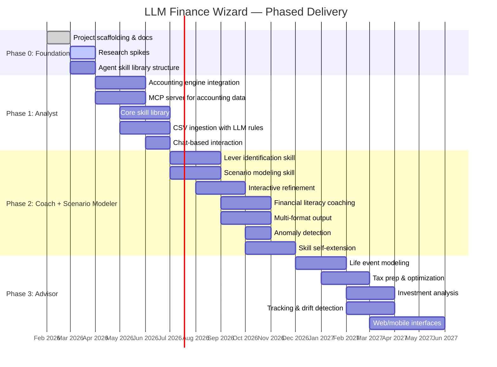

# Roadmap

Phased delivery plan for LLM Finance Wizard. Extracted from VISION-001 Section 6 (Phased Delivery) to enable independent tracking.

---

## Timeline

## Phase Status

| Phase | Status | Success Gate | Notes |
|-------|--------|-------------|-------|
| **Phase 0: Foundation** | Active | Scaffolding, docs, research spikes, skill structure | Current phase |
| **Phase 1: Analyst** | Planned | User asks financial question → agent queries data, writes code, delivers grounded answer | Core loop |
| **Phase 2: Coach + Scenario Modeler** | Planned | User identifies goal → agent surfaces levers, models scenarios, helps converge on plan | Full core loop |
| **Phase 3: Advisor** | Planned | User navigates major financial decision with agent analysis a planner would consider substantive | Strategic guidance |

## Phase Details

### Phase 0: Foundation (Current)

- Project scaffolding, documentation infrastructure, and vision
- Research spikes for key technical decisions
- Agent skill library structure

### Phase 1: Analyst (Core Loop)

Build the core analysis loop: structured data in, code-executed analysis out.

- Accounting engine integration (hledger first, Beancount second)
- MCP server exposing accounting data to the agent
- Core skill library: spending analysis, net worth, cash flow, basic lever identification
- Code execution for custom analyses
- Chat-based interaction as primary interface
- CSV ingestion with LLM-assisted rules generation

### Phase 2: Coach + Scenario Modeler

The phase where the core loop comes together.

- Lever identification skill
- Scenario modeling skill: combinatorial what-if modeling
- Interactive scenario refinement
- Financial literacy coaching skills
- Multi-format output: dashboards, slide decks, PDF reports
- Anomaly detection and proactive insights
- Skill self-extension
- Automated bank sync integration (Plaid)

### Phase 3: Advisor

Graduate from reactive analysis to proactive, strategic guidance.

- Life event modeling
- Tax preparation and optimization
- Investment allocation analysis
- Tracking and drift detection
- Community skill marketplace
- Web/mobile interfaces
